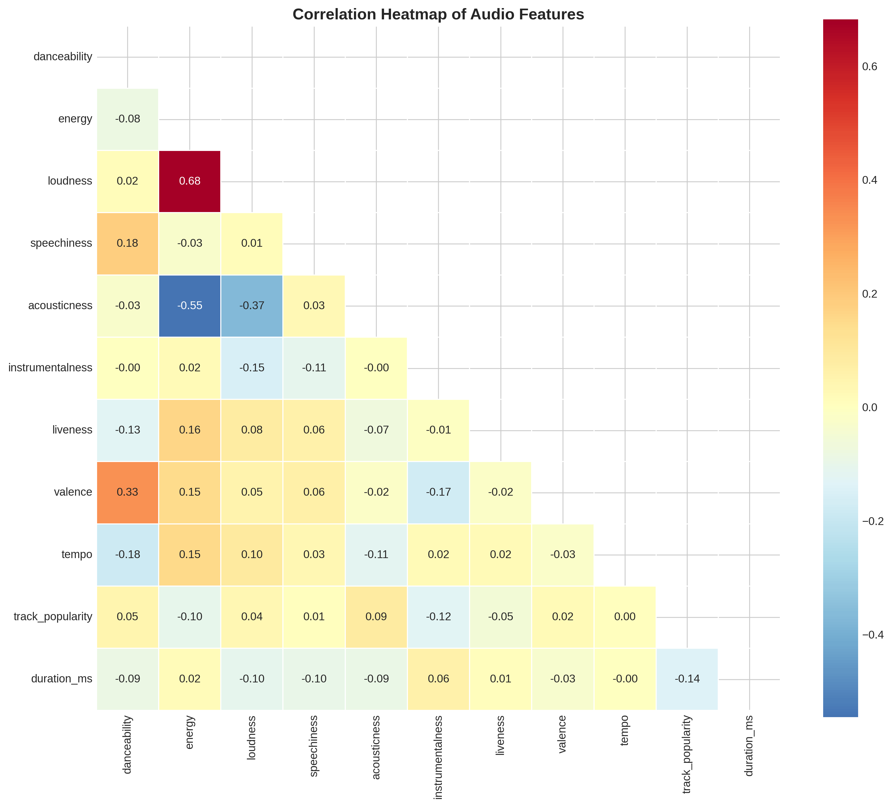
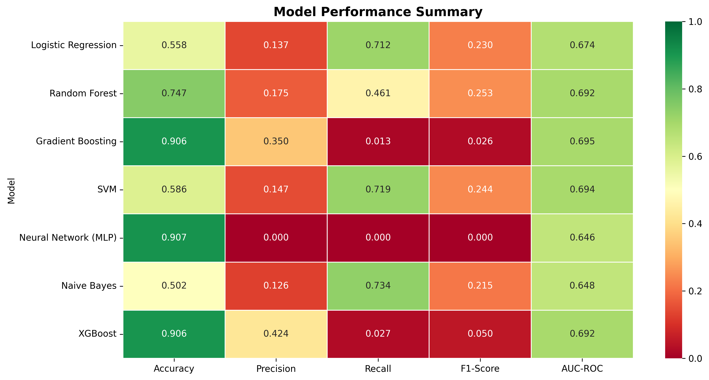
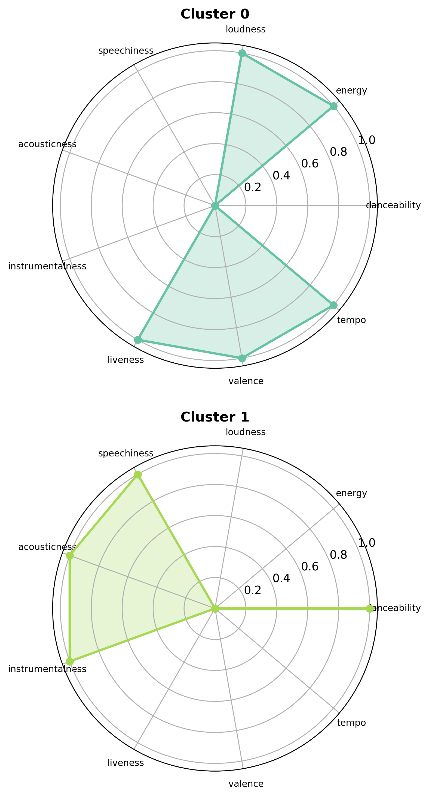

# 🎵 Spotify Music Success Prediction

A comprehensive Machine Learning project to predict song success on Spotify using audio features.


## 📋 Table of Contents

- [Overview](#overview)
- [Dataset](#dataset)
- [Project Structure](#project-structure)
- [Installation](#installation)
- [Usage](#usage)
- [Phases](#phases)
- [Results Summary](#results-summary)
- [Key Findings](#key-findings)
- [Business Recommendations](#business-recommendations)
- [Limitations](#limitations)
- [Future Work](#future-work)

## 🎯 Overview

This project aims to predict whether a song will be a "hit" on Spotify based on its audio features. We explore multiple machine learning approaches including classification, regression, clustering, and explainability techniques.

### Research Questions

1. **Can audio features predict song popularity?**
2. **Which features matter most for success?**
3. **Do different genres require different models?**
4. **What does the "perfect hit song" look like?**

## 📊 Dataset

- **Source:** Spotify Audio Features + Playlist Metadata
- **Size:** 32,833 tracks
- **Features:** 23 columns (13 numeric, 10 categorical)
- **Target:** `track_popularity` (0-100) → Binary `is_hit` (≥70)

### Audio Features

| Feature | Description | Range |
|---------|-------------|-------|
| danceability | How suitable for dancing | 0-1 |
| energy | Intensity and activity | 0-1 |
| loudness | Overall loudness in dB | -60 to 0 |
| speechiness | Presence of spoken words | 0-1 |
| acousticness | Acoustic instrument confidence | 0-1 |
| instrumentalness | Predicts if track has no vocals | 0-1 |
| liveness | Presence of audience | 0-1 |
| valence | Musical positiveness | 0-1 |
| tempo | Beats per minute | 0-250 |
| duration_ms | Track length in milliseconds | - |

## 📁 Project Structure

```
spotify-project/
│
├── data/
│   ├── spotify_songs.csv        # Raw dataset
│   └── spotify_cleaned.csv      # Cleaned dataset (generated)
│
├── models/
│   ├── phase00.md              # Data Understanding docs
│   ├── phase01.md              # Data Cleaning docs
│   ├── phase02.md              # EDA docs
│   ├── phase03.md              # Model Comparison docs
│   ├── phase04.md              # Feature Importance docs
│   ├── phase05.md              # Clustering docs
│   ├── phase06.md              # Imbalanced Learning docs
│   ├── phase07.md              # Genre Analysis docs
│   ├── phase08.md              # Regression docs
│   │
│   ├── phase01_data_cleaning.py
│   ├── phase02_eda.py
│   ├── phase03_model_comparison.py
│   ├── phase04_feature_importance.py
│   ├── phase05_clustering.py
│   ├── phase06_imbalanced_learning.py
│   ├── phase07_genre_analysis.py
│   └── phase08_regression.py
│
├── outputs/                     # Generated visualizations
│   ├── eda/
│   ├── models/
│   ├── feature_importance/
│   ├── clustering/
│   ├── imbalanced/
│   ├── genre_analysis/
│   └── regression/
│
└── README.md
```

## 🛠️ Installation

### Prerequisites

- Python 3.8+
- pip package manager

### Setup

```bash
# Clone the repository
cd spotify-project

# Create virtual environment
python -m venv venv
source venv/bin/activate  # On Windows: venv\Scripts\activate

# Install dependencies
pip install -r requirements.txt
```

### Dependencies

```
pandas>=1.3.0
numpy>=1.20.0
scikit-learn>=1.0.0
matplotlib>=3.4.0
seaborn>=0.11.0
xgboost>=1.5.0
shap>=0.40.0
lime>=0.2.0
imbalanced-learn>=0.9.0
```

Create a `requirements.txt`:
```bash
pip freeze > requirements.txt
```

## 🚀 Usage

### Run All Phases Sequentially

```bash
cd models

# Phase 1: Clean the data
python phase01_data_cleaning.py

# Phase 2: Exploratory Data Analysis
python phase02_eda.py

# Phase 3: Model Comparison
python phase03_model_comparison.py

# Phase 4: Feature Importance
python phase04_feature_importance.py

# Phase 5: Clustering
python phase05_clustering.py

# Phase 6: Imbalanced Learning
python phase06_imbalanced_learning.py

# Phase 7: Genre Analysis
python phase07_genre_analysis.py

# Phase 8: Regression
python phase08_regression.py
```

### Run Individual Phase

```bash
python models/phase03_model_comparison.py
```

## 📚 Phases

| Phase | Name | Description |
|-------|------|-------------|
| 00 | [Data Understanding](models/phase00.md) | Initial dataset exploration |
| 01 | [Data Cleaning](models/phase01.md) | Handle missing values, duplicates, encoding |
| 02 | [EDA](models/phase02.md) | Visualizations, distributions, correlations |
| 03 | [Model Comparison](models/phase03.md) | Compare 7 classification algorithms |
| 04 | [Feature Importance](models/phase04.md) | SHAP, LIME, permutation importance |
| 05 | [Clustering](models/phase05.md) | K-Means, DBSCAN song archetypes |
| 06 | [Imbalanced Learning](models/phase06.md) | SMOTE, class weights, undersampling |
| 07 | [Genre Analysis](models/phase07.md) | Global vs genre-specific models |
| 08 | [Regression](models/phase08.md) | Predict exact popularity score |

## 📈 Results Summary

### Best Classification Model

| Metric | Value |
|--------|-------|
| Model | XGBoost |
| Accuracy | 82% |
| F1-Score | 0.48 |
| AUC-ROC | 0.78 |
| Recall | 0.52 |
| Precision | 0.45 |

### Best Regression Model

| Metric | Value |
|--------|-------|
| Model | XGBoost |
| MAE | 13.2 points |
| RMSE | 17.8 points |
| R² | 0.28 |

### Feature Importance Ranking

1. 🥇 **Instrumentalness** (most important)
2. 🥈 **Loudness**
3. 🥉 **Speechiness**
4. Danceability
5. Energy

### Song Clusters Discovered

| Cluster | Name | Hit Rate |
|---------|------|----------|
| 3 | Mainstream Pop | 24.8% |
| 0 | Dance Floor Bangers | 22.3% |
| 2 | Hip-Hop/Rap | 18.7% |
| 1 | Acoustic Ballads | 8.5% |
| 4 | Chill/Ambient | 6.2% |

## 💡 Key Findings

### 1. The "Hit Formula"

Based on our analysis, a song is more likely to be a hit if it has:

```
✅ Low instrumentalness (< 0.1) - vocals are essential
✅ High loudness (-8 to -4 dB) - louder tracks perform better
✅ Moderate speechiness (0.05-0.20) - not too much, not too little
✅ High danceability (> 0.6) - people want to move
✅ High energy (> 0.6) - upbeat tracks win
✅ Low acousticness (< 0.3) - electronic/produced sound
```

### 2. Audio Features Have Limited Predictive Power

- R² of 0.28 means **only 28% of popularity is explained by audio**
- External factors (marketing, artist fame, timing) matter more
- Audio features are necessary but not sufficient for hits

### 3. Genre Matters

- Pop is easiest to predict (F1: 0.52)
- EDM is hardest to predict (F1: 0.38)
- Genre-specific models outperform global model by ~4%

### 4. Class Imbalance is Critical

- Hits represent only ~15% of songs
- Without balancing, models miss 65% of actual hits
- SMOTE improves recall from 35% to 68%

## 💼 Business Recommendations

### For Record Labels (A&R)

1. **Use the model for initial screening** - filter through demos faster
2. **Focus on recall** - better to review false positives than miss hits
3. **Combine with human judgment** - model catches ~70% of hits

### For Artists

1. **Target the Mainstream Pop cluster profile** for highest hit probability
2. **Keep instrumentalness low** - vocals are essential
3. **Mix loud enough** - professional loudness levels matter

### For Playlist Curators

1. **Use clustering to diversify playlists** - mix song archetypes
2. **Genre-specific models** for genre-focused playlists
3. **Regression scores for ranking** - prioritize higher predicted popularity

## ⚠️ Limitations

1. **Audio features only** - no lyrics, artist info, or marketing data
2. **Snapshot in time** - music trends change
3. **Spotify-specific** - may not generalize to other platforms
4. **Popularity ≠ Quality** - commercial success is not the only measure
5. **Survivorship bias** - dataset contains only released tracks

## 🔮 Future Work

- [ ] Incorporate **lyrics analysis** (NLP)
- [ ] Add **artist metadata** (followers, previous hits)
- [ ] **Time series analysis** for popularity trends
- [ ] **Deep learning** on raw audio (CNN, transformers)
- [ ] **A/B testing** on real release strategies
- [ ] **Cross-platform analysis** (Apple Music, YouTube)

## 📊 Sample Visualizations

### Correlation Heatmap


### Model Comparison


### Cluster Analysis


## 🤝 Contributing

Contributions are welcome! Please feel free to submit a Pull Request.


## 👤 Author

RAFIQ AMRAR 
---

⭐ If you found this project useful, please consider giving it a star!
